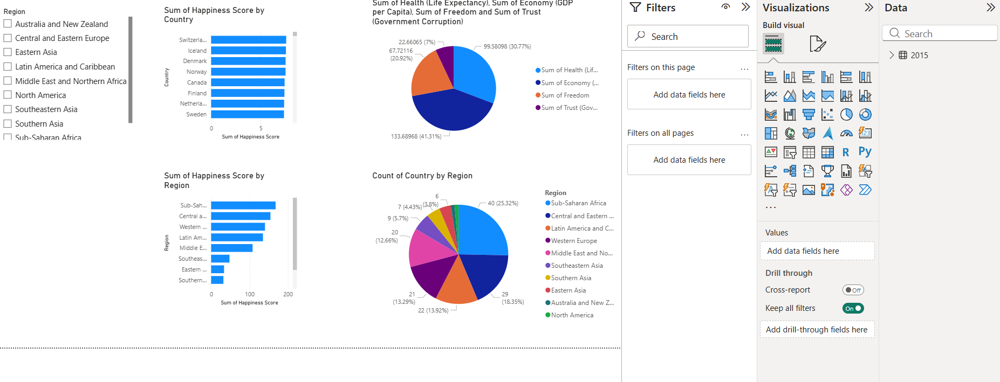

# Task 3: Power BI Dashboard 📊

## 📌 Description
In this task, I created an interactive Power BI dashboard to analyze business data and extract meaningful insights. The dashboard helps in understanding trends, performance, and key metrics using visual representations.

## 📊 Features
- Data visualization using charts and graphs  
- KPI indicators for performance tracking  
- Interactive filters and slicers  
- Insights on sales and profit trends  

## 🛠 Tools Used
- Power BI  
- Data Visualization Techniques  

## 📷 Output

